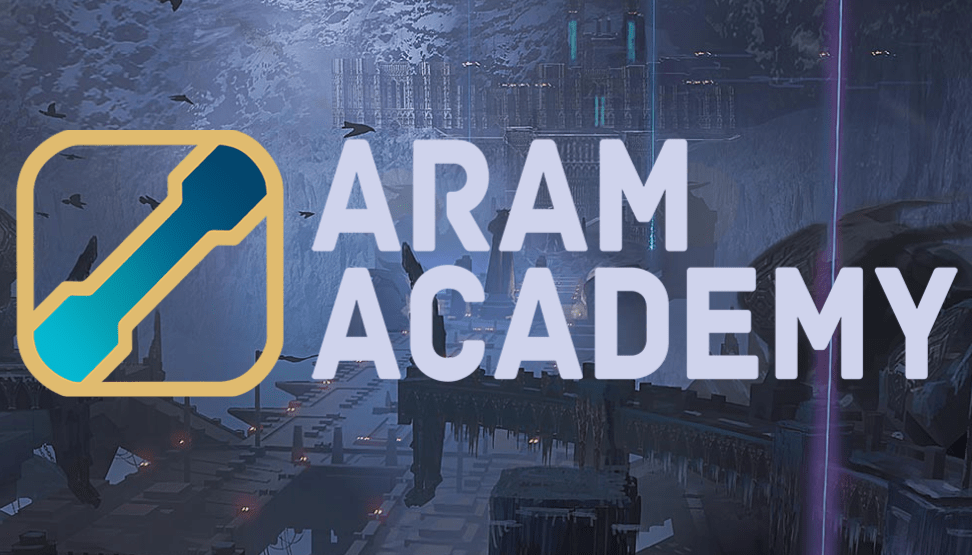
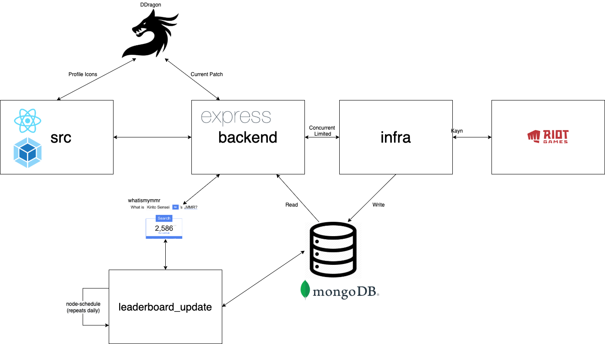

# [ARAM Academy](https://aram.academy)



ARAM Academy is an ARAM-exclusive statistics aggregator for League of Legends. We provide leaderboards, rank badge estimates, and champion-level winrates across the entirety of a players ARAM data provided by the Riot API.

Visit us today at https://aram.academy and join our [Discord](https://discord.gg/MydvqhqWmM)

## Hosting

ARAM Academy is hosted on a `t2.medium` AWS instance. Our MongoDB instance is hosted on Mongo DB Atlas.

## Directory Structure

- `src` - Front end UI. Written in React and styled with Material UI. `app.js` is the main entrypoint and `index.js` does the URL routing. `resources.js` contains some hardcoded champion data (e.g. converting DB names MonkeyKing => Wukong). A note about images: webpack grabs and packages images into the `dist/static` directory. It will automatically pick up any image references you make, but you must `require.context` them (like the `resources.js` file does)
- `backend` - Our backend is implemented with `express`. backendAPIRouter.js handles API calls to our ARAM data infrastructure (`infra_entrypoint.js`) as well as other GET and POST requests for things like MMR from WhatIsMyMMR, current patch from DDragon. We await on our infra calls, but limit the number of concurrent async requests being processed.
- `dist` - Images generated from webpack
- `logs` - Error logs generated from infra
- `infra` - `infra_entrypoint.js` is the main entrypoint. Calls to Kayn API are sectioned into `kayn_calls.js`. Utility definitions of enums, constants, and data manipulation functions are found in `utils.js`. `leaderboard_update.js` handles updating the leaderboard on a daily basis. It grabs all high elo games from a recent time period and checks MMR from WhatIsMyMMR. `champion_icons.py` loads champion icons from DDragon.
- `models` - mongoDB table models



## Overview

When a user enters their summoner_name, a request is directed to the `Users` page and a request is made to `backendAPIRouter`, which calls into `processUser` of `infra_entrypoint`. For new users infra aggregates all games available to the Riot API, otherwise the MongoDB record for that user is returned. Users page then refreshes on load depending on if the summoner name is valid or not. Update button runs very similarly - when update is clicked, infra calculates a 'delta' of all ARAM games since the last_processed_game timestamp of this user. These timestamps are attached to the match record data from the Riot API, which we store in MongoDB.

We implement separate React components for mobile UI which are served using the `isMobile` npm package.

Leaderboard runs separately from our main server, and updates daily overnight.

## Execution Instructions

We welcome open source contributors of all types! Please join our [Discord](https://discord.gg/MydvqhqWmM) community and our team can help with setup.

1. Install [`node.js`](https://nodejs.org/en/download/)

2. Install node dependencies with `npm install`
3. Install `nodemon` globally with `npm install nodemon -g` in same directory
4. Whitelist IP in MongoDB Atlas project
5. Start server with `npm run start`
6. Create a `.env` file in the root folder with the following definitions. For keys and DB URIs please either make your own or contact us in the ARAM Academy Discord.

```
RIOT_API_KEY=key
DEV_MODE=dev
DB_URI=uri
```
